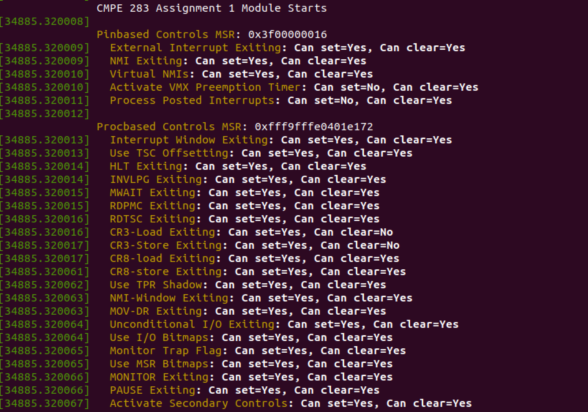
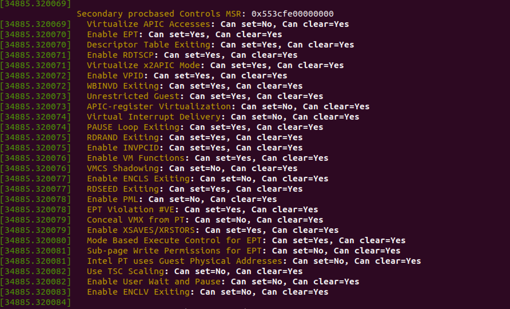
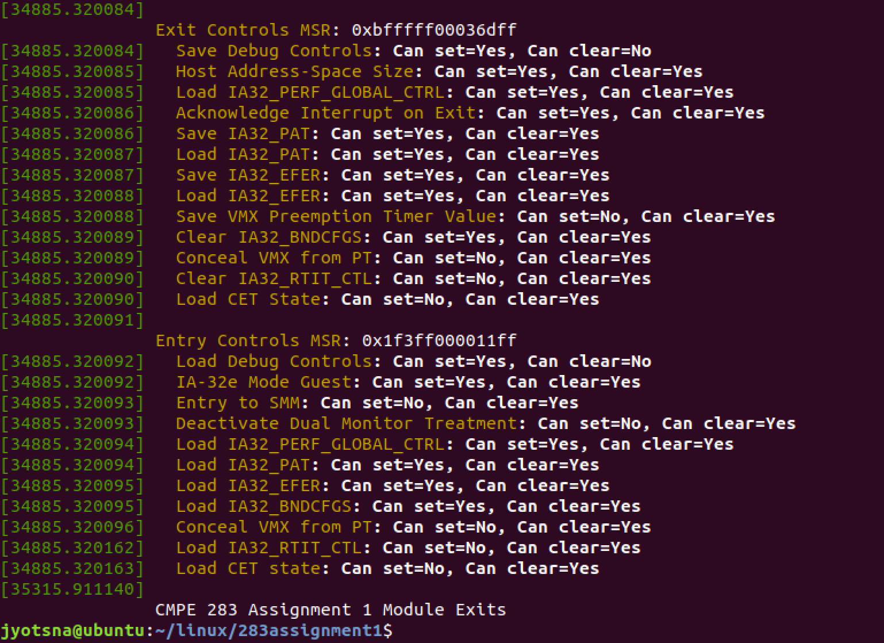

# Assignment: Discovering VMX Features

## Aim: To create a Linux kernel module that will query various MSRs to determine virtualization features available in your CPU. This module will report (via the system message log) the features it discovers.

## Steps followed:

### Configure a Linux machine
1. Download VMWare Fusion and install it
2. Download the .iso file for Ubuntu version 18.04
3. Open VMWare, create a VM, and install Ubuntu OS on it. I did it with following specs:
    Memory: 5 GB, CPU Cores: 2, Disk: 120 GB
4. Install git

### Download and build the Linux kernel source code
5. Fork the repository where the Kernel code is available and git clone the code from own repository
6. Go to the downloaded directory and install the necessary packages:
    
    `cd linux`
    
    `sudo apt-get update`
    
    `sudo apt-get install gcc, build-essential, flex, kernel-package fakeroot libncurses5-dev libssl-dev ccache bison`
7. Copy the .config<kernel-version> file from /boot to current directory and run command:
     
     `make oldconfig`
8. Select all the default answers and proceed. This will update the .config file with the latest configurations
9. Run the following command to build the kernel modules.

    `make -j <number of parallel processes>`
    Here, the number of parallel processes to run should be the number of cores assigned to the VM while creating it. In my case it was 2. The process took around 1.5 hours.

### Create a new kernel module with the assignment functionality
10. Create a new directory in the kernel code. Inside linux/ directory:

    `mkdir 283assignment1`
    `cd 283assignment1`
11. Copy the starter code files cmpe283-1.c and Makefile to this directory
12. Make required changes in cmpe283-1.c file to include all the assignment functionality. (Referred to the Intel SDM for the list of MSRs)

### Load (insert) the new module
13. Load the module into the kernel using the following command (use sudo or login as root):

    `sudo insmod ./cmpe283-1.ko`
    Above command calls the init_module() function of this new module which will call the detect_vmx_features() function
14. We can stop the module using command:

    `sudo rmmod ./cmpe283-1.ko`
    The above command calls the cleanup_module() function of the module

### Verify proper output in the system message log
15. Run command to see kernel buffer/ log:
    `dmesg`

16. The output seems something like this:
    
    
    
